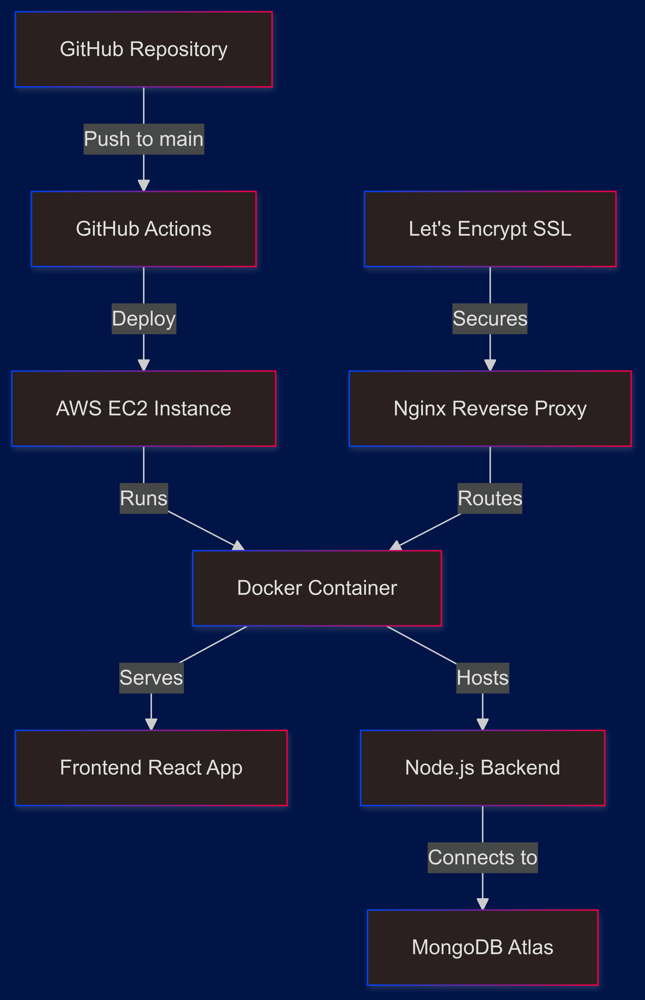

# EC2 Deployment with Docker and SSL for MERN Project

This readme is a well-organized guide for this project and its components. It will walk you through provisioning infrastructure with Terraform, developing a React + Node.js application, containerizing with Docker, implementing a CI/CD pipeline, and securing it with SSL via Let’s Encrypt.

---

## Flow Diagram and Prerequisites

<table style="border-collapse: collapse; width: 100%;">
  <tr>
    <td style="vertical-align: top; padding-right: 20px;">
      <p align="center">
        
      </p>
    </td>
    <td style="vertical-align: top;">
      <h3>Prerequisites</h3>
      <ul>
        <li>AWS account with an EC2 key pair (used to SSH into the instance).</li>
        <li>Terraform installed on your local machine (for infrastructure as code).</li>
        <li>Docker Engine (can be on your local machine or directly on the EC2 instance).</li>
        <li>GitHub account to store repository secrets (used for CI/CD).</li>
        <li>Basic familiarity with React, Node.js, environment variables, and shell operations.</li>
      </ul>
      <p>For deeper knowledge, consult:</p>
      <ul>
        <li><a href="https://developer.hashicorp.com/terraform/docs">Terraform Docs</a></li>
        <li><a href="https://docs.docker.com/">Docker Docs</a></li>
        <li><a href="https://nodejs.org/en/docs">Node.js Docs</a></li>
        <li><a href="https://react.dev/">React Docs</a></li>
        <li><a href="https://certbot.eff.org/">Certbot</a></li>
        <li><a href="https://docs.nginx.com/">Nginx Docs</a></li>
      </ul>
    </td>
  </tr>
</table>

---

## Step 1: Terraform Provisioning

Start by creating foundational AWS resources with Terraform. This includes:

• VPC (Virtual Private Cloud) to isolate the network.  
• Public Subnet linked to an Internet Gateway for external access.  
• Security Group allowing inbound traffic on ports 22 (SSH), 80 (HTTP), and 443 (HTTPS).  
• EC2 instance configured with an IAM role giving read access to AWS Secrets Manager (for storing MongoDB credentials).  
• Elastic IP to ensure a static IP address for the EC2 instance.

### Key Commands
```bash
terraform init   # Prepares plugins/providers
terraform plan   # Previews infrastructure changes
terraform apply  # Creates or updates infrastructure
```

### Changes Made
Modularize the Terraform configuration to encapsulate VPC, subnets, and security group logic for reusability. This approach makes the infrastructure more scalable and easier to manage.

### Elastic IP Usage
An Elastic IP is linked to the EC2 instance to ensure a static IP address. This is important because the public IP address of an EC2 instance changes if the instance is rebooted or stopped. An Elastic IP does not incur any cost as long as it is associated with a running instance.

### Challenge
Try adding an additional security group rule to allow inbound traffic on port 8080 for future use.

---

## AWS Infrastructure Details

### VPC Configuration
The Virtual Private Cloud (VPC) is configured with the following components:

```hcl
VPC CIDR: 10.0.0.0/16
Public Subnet: 10.0.1.0/24
Private Subnet: 10.0.2.0/24
```

#### Subnet Configuration
- **Public Subnet**
  - Used for: EC2 instances that need internet access
  - Auto-assign public IP: Yes
  - Route table: Connected to Internet Gateway
  
- **Private Subnet**
  - Used for: Internal resources (future databases, caching)
  - Auto-assign public IP: No
  - Route table: Connected to NAT Gateway

### Security Group Configuration
The EC2 instance uses the following security group rules:

#### Inbound Rules
```plaintext
Port 22 (SSH)      : TCP : Source 0.0.0.0/0 : SSH access
Port 80 (HTTP)     : TCP : Source 0.0.0.0/0 : HTTP traffic
Port 443 (HTTPS)   : TCP : Source 0.0.0.0/0 : HTTPS traffic
Port 3000 (API)    : TCP : Source 0.0.0.0/0 : Node.js API
Port 27017 (MongoDB): TCP : Source 10.0.0.0/16 : MongoDB (VPC only)
```

#### Outbound Rules
```plaintext
All Traffic : All : Destination 0.0.0.0/0 : Allow all outbound traffic
```

### IAM Policy Requirements

#### EC2 Instance Profile
The EC2 instance requires the following IAM policy for AWS Secrets Manager access:

```json
{
    "Version": "2012-10-17",
    "Statement": [
        {
            "Effect": "Allow",
            "Action": [
                "secretsmanager:GetSecretValue",
                "secretsmanager:DescribeSecret"
            ],
            "Resource": [
                "arn:aws:secretsmanager:${AWS_REGION}:${ACCOUNT_ID}:secret:mongodb_url2-??????"
            ]
        }
    ]
}
```

#### Additional IAM Policies Required

1. **CloudWatch Logs Policy**
```json
{
    "Version": "2012-10-17",
    "Statement": [
        {
            "Effect": "Allow",
            "Action": [
                "logs:CreateLogGroup",
                "logs:CreateLogStream",
                "logs:PutLogEvents"
            ],
            "Resource": "arn:aws:logs:*:*:*"
        }
    ]
}
```

2. **S3 Access Policy (if needed for static files)**
```json
{
    "Version": "2012-10-17",
    "Statement": [
        {
            "Effect": "Allow",
            "Action": [
                "s3:GetObject",
                "s3:PutObject",
                "s3:ListBucket"
            ],
            "Resource": [
                "arn:aws:s3:::your-bucket-name",
                "arn:aws:s3:::your-bucket-name/*"
            ]
        }
    ]
}
```

### Network ACL (NACL) Configuration
Additional layer of security at the subnet level:

#### Inbound Rules
```plaintext
Rule # | Type    | Protocol | Port Range | Source       | Allow/Deny
100    | HTTP    | TCP      | 80         | 0.0.0.0/0   | ALLOW
110    | HTTPS   | TCP      | 443        | 0.0.0.0/0   | ALLOW
120    | SSH     | TCP      | 22         | 0.0.0.0/0   | ALLOW
130    | Custom  | TCP      | 3000       | 0.0.0.0/0   | ALLOW
140    | Custom  | TCP      | 27017      | 10.0.0.0/16 | ALLOW
* All other inbound traffic is DENIED by default
```

#### Outbound Rules
```plaintext
Rule # | Type    | Protocol | Port Range | Destination | Allow/Deny
100    | All TCP | TCP      | 1024-65535 | 0.0.0.0/0  | ALLOW
110    | HTTP    | TCP      | 80         | 0.0.0.0/0  | ALLOW
120    | HTTPS   | TCP      | 443        | 0.0.0.0/0  | ALLOW
* All other outbound traffic is DENIED by default
```

### Best Practices for Security

1. **VPC Flow Logs**
   - Enable VPC Flow Logs to monitor network traffic
   - Store logs in CloudWatch for analysis
   - Set up alerts for suspicious activity

2. **Security Group Management**
   - Regularly audit security group rules
   - Remove unused rules
   - Use specific IP ranges instead of 0.0.0.0/0 where possible
   - Tag security groups for better organization

3. **Access Management**
   - Use IAM roles instead of access keys
   - Implement least privilege principle
   - Regularly rotate credentials
   - Enable MFA for AWS console access

4. **Network Security**
   - Use private subnets for sensitive resources
   - Implement NAT Gateway for outbound internet access
   - Enable VPC endpoints for AWS services
   - Use AWS Systems Manager Session Manager instead of direct SSH

---

## Step 2: React Frontend & Node Backend

Once the EC2 instance is up, build a React application with Vite for frontend pages (Login, Register, Welcome) and a Node.js/Express backend connected to MongoDB Atlas. Manage environment variables locally using .env files and store credentials in AWS Secrets Manager.

### Frequently Used Commands
```bash
# In the frontend directory
npm install
npm run dev

# In the backend directory
npm install
npm start
```

### Changes Made
Separate Express routes logically (e.g., userRoutes.js, authRoutes.js) and add structured logging using Winston. This improves code clarity and makes production debugging simpler.

### Challenge
Implement a new route in the backend to handle user profile updates and test it with Postman.

---

## Step 3: Docker Containerization

To standardize deployments across local and production environments, create Dockerfiles. The approach is:

• Build the frontend with Vite, generating a “dist” folder.  
• Copy that “dist” output into the backend container so everything runs on port 3000 (or whichever port you configure).  
• Use Docker Compose for local testing, easily spinning up containers.

### Common Docker Commands
```bash
# Build and run local containers with Docker Compose
docker-compose up --build

# Remove images and networks if they persist
docker-compose down --rmi all
docker system prune -af
```

### Changes Made
Optimize Dockerfiles using multi-stage builds to keep images small and efficient. Additionally, set up Docker without sudo on EC2 for easier management.

### Installing Docker on EC2
```bash
sudo yum update -y
sudo yum install -y docker
sudo systemctl start docker
sudo systemctl enable docker
sudo usermod -a -G docker ec2-user
```

### Challenge
Create a Dockerfile for a simple Nginx server and deploy it using Docker Compose.

---

## Step 4: CI/CD with GitHub Actions

Automate the build and deployment strategy by setting up a GitHub Actions workflow:

• Source code push triggers the pipeline.  
• Docker images are built, tagged, and pushed to Docker Hub.  
• Workflow then SSHs into the EC2 instance to pull and run the latest image.

### Typical GitHub Actions Example
```yaml
on:
  push:
    branches: [ "main" ]

jobs:
  build-and-deploy:
    runs-on: ubuntu-latest
    steps:
      - name: Check out repository
        uses: actions/checkout@v2
      # ...
```

### Challenge
Add a step in the GitHub Actions workflow to run unit tests before building the Docker image.

---

## Step 5: SSL with Let’s Encrypt & Nginx

Secure the website:

• Acquire a DuckDNS subdomain pointing to the EC2 public IP.  
• Install Nginx and Certbot to generate a free SSL certificate via Let’s Encrypt.  
• Adjust the Nginx config to redirect all traffic on port 80 to port 443.

### Sample Commands for SSL Setup
```bash
sudo yum install -y nginx
sudo systemctl start nginx
sudo systemctl enable nginx

sudo yum install -y certbot python3-certbot-nginx
sudo certbot --nginx -d myapp.duckdns.org
sudo nginx -t
sudo systemctl restart nginx
curl -v https://myapp.duckdns.org
```

### Important Files for Configuring SSL
- **Nginx Configuration File**: `/etc/nginx/nginx.conf`
- **Certbot Configuration**: Managed by Certbot, typically located in `/etc/letsencrypt/`

### Changes Made
Schedule crontab tasks to automatically renew SSL certificates and periodically verify the renewal process.

### Challenge
Configure Nginx to serve a custom 404 error page.

---

## Registering a Free Domain with DuckDNS
To make the application accessible via a domain name, register a free domain from DuckDNS. DuckDNS is a free dynamic DNS service that allows creating a subdomain and pointing it to the public IP address.

### Pros
• **Free Service**: DuckDNS provides free subdomains, which is great for small projects and personal use.
• **Easy Setup**: The setup process is straightforward and quick.
• **Dynamic DNS**: It automatically updates the IP address if it changes, which is useful for home networks with dynamic IPs.

### Cons
• **Limited Customization**: Limited to the subdomains provided by DuckDNS, which may not be suitable for professional or commercial use.
• **Reliability**: As a free service, it may not offer the same level of reliability and support as paid DNS services.

### Steps to Register
1. Go to [DuckDNS](https://www.duckdns.org/).
2. Sign in with your preferred authentication method (e.g., GitHub, Google).
3. Create a new subdomain and point it to the EC2 instance's public IP address.
4. Update the Nginx configuration to use this subdomain.

---

## Results

By following these steps, the following is achieved:

• A fully provisioned AWS infrastructure with Terraform.  
• A React frontend and Node.js backend integrated and running smoothly.  
• Docker containers ensuring consistent environments across local and production setups.  
• An automated CI/CD pipeline with GitHub Actions.  
• A secure website with SSL via Let’s Encrypt.  
• A free domain from DuckDNS pointing to the application.

---

## Final Challenge

Combine all the concepts learned to deploy a new feature end-to-end. For example, add a new page to the React frontend, create corresponding backend routes, update the Docker setup, and ensure the CI/CD pipeline deploys the changes automatically. Secure the new feature with SSL and test it thoroughly.

---

## Conclusion

Throughout this project, heavy reliance on documentation and trial-and-error was necessary. The five segments—Terraform provisioning, building the React & Node app, containerization with Docker, automating with GitHub Actions, and finally adding SSL—required persisting through errors and refining configurations.

Key lessons:  
1. Terraform’s approach to infrastructure as code is powerful, but demands clarity with IAM policies.  
2. Storing secrets in AWS Secrets Manager helps keep sensitive information off public repositories.  
3. Docker Compose simplifies local testing before committing to production.  
4. GitHub Actions eliminates manual rebuilds and deployments.  
5. Let’s Encrypt, through Certbot and Nginx, provides a straightforward path to HTTPS without extra costs.  
6. DuckDNS offers a quick and free way to get a domain name, though it has limitations for professional use.

#### Tip: By following each step methodically, this full-stack deployment can be replicated or expanded for other use cases. Should hurdles arise, remember they’re part of the learning journey—and rely on official docs or community forums for help.

### Happy coding!
